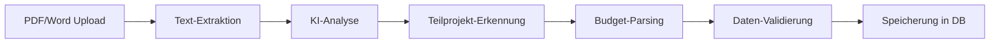

# 📋 Gesuch → Rapport Transformation - Vollständiges Konzept
## SBV Professional App

---

## 🎯 Executive Summary

Das System automatisiert die Erstellung von Jahresrapporten aus Förderanträgen (Gesuchen). Ein Gesuch für ein Jahr (z.B. 2024) wird in **6 Teilprojekt-Rapporte** aufgeteilt, wobei Daten automatisch extrahiert und übertragen werden.

**Kernfunktionalität:**
- 📄 Upload von Gesuch-Dokumenten (PDF/Word)
- 🤖 KI-basierte Texterkennung und Datenextraktion
- 🔄 Automatische Generierung von 6 Rapporten
- 💰 Budget-Tracking pro Teilprojekt
- ✅ Validierung und manuelle Korrektur

---

## 📊 Datenmodell & Struktur

### 1. **Gesuch (Förderantrag)**

Ein Gesuch ist der jährliche Hauptantrag mit folgendem Inhalt:

```typescript
interface Gesuch {
  // Identifikation
  id: number;
  jahr: number;                    // z.B. 2024
  titel: string;                   // "Förderantrag SBV 2024"
  
  // Dokument
  datei_pfad: string;              // uploads/gesuche/2024_sbv_antrag.pdf
  datei_name: string;              // "2024_sbv_antrag.pdf"
  datei_typ: string;               // "application/pdf"
  datei_groesse: number;           // in Bytes
  
  // Extrahierte Daten (JSON)
  extrahierte_daten: {
    teilprojekte: Teilprojekt[];
    metadata: {
      jahr: string;
      antragsteller: string;
      gesamtbudget: number;
      eingereicht_am: string;
      kontaktperson: string;
    };
    texte: {
      ziele: string;
      hintergrund: string;
      methodik: string;
    };
  };
  
  // Status
  status: 'hochgeladen' | 'verarbeitet' | 'fehler' | 'genehmigt';
  bearbeitet_von: number;          // User ID
  created_at: DateTime;
  updated_at: DateTime;
}
```

### 2. **Teilprojekte (6 Standard-Kategorien)**

Jedes Gesuch wird in genau 6 Teilprojekte aufgeteilt:

```typescript
interface Teilprojekt {
  id: number;
  gesuch_id: number;               // Referenz zum Hauptgesuch
  nummer: string;                  // "TP1" bis "TP6"
  name: string;                    // Standardisierte Namen
  budget: number;                  // CHF Betrag
  
  // Standardisierte Teilprojekte:
  // TP1: Leitmedien       - 1'650'000 CHF
  // TP2: Onlinemedien     -   920'000 CHF
  // TP3: TV               -   410'000 CHF
  // TP4: Radio            -   740'000 CHF
  // TP5: Bevölkerung      -   450'000 CHF
  // TP6: Weiterbildung    -   240'000 CHF
  // TOTAL:                  4'410'000 CHF
  
  beschreibung: string;            // Aus Gesuch extrahiert
  ziele: string[];                 // K-Ziele aus Gesuch
  massnahmen: string[];            // Geplante Massnahmen
  
  // Tracking
  automatisch_erkannt: boolean;    // Durch KI erkannt?
  manuell_korrigiert: boolean;     // Wurde nachbearbeitet?
  rapport_id: number;              // Generierter Rapport
}
```

### 3. **Rapport (Generierte Berichte)**

Aus jedem Teilprojekt wird automatisch ein Rapport generiert:

```typescript
interface Rapport {
  // Grunddaten
  id: number;
  titel: string;                   // "TP1 Leitmedien - 2024"
  
  // Automatisch befüllte Felder aus Gesuch
  datum: Date;                     // Aktuelles Datum
  beschreibung: string;            // Aus Teilprojekt-Beschreibung
  arbeitszeit: number;             // Geschätzt aus Budget
  abteilung: string;               // Aus TP-Name abgeleitet
  budget: number;                  // Aus Teilprojekt
  
  // Strukturierte Inhalte aus Gesuch
  k_ziele_beitraege: {
    ziele: string[];               // K-Ziele aus Gesuch
    beitraege: string[];           // Erwartete Beiträge
    messmethodik: string;          // Wie wird gemessen?
  };
  
  massnahmen: {
    geplant: MassnahmeItem[];      // Aus Gesuch-Tabelle
    durchgefuehrt: MassnahmeItem[]; // Wird später befüllt
  };
  
  herausforderungen: string;       // Initial leer, später befüllt
  
  // Verknüpfungen
  gesuch_id: number;               // Referenz zum Ursprungs-Gesuch
  teilprojekt_id: number;          // Referenz zum Teilprojekt
  
  // Workflow
  status: 'entwurf' | 'eingereicht' | 'in_bearbeitung' | 'fertig' | 'genehmigt';
  author_id: number;
  assigned_to: number;
  
  // Zeitstempel
  created_at: DateTime;
  updated_at: DateTime;
}
```

---

## 🔄 Datenfluss & Transformation

### Phase 1: **Gesuch-Upload & Verarbeitung**



**Extrahierte Datenfelder:**

1. **Metadata:**
   - Jahr des Gesuchs
   - Antragsteller/Organisation
   - Eingabedatum
   - Gesamtbudget
   - Kontaktpersonen

2. **Teilprojekt-Daten:**
   - Name und Nummer (TP1-TP6)
   - Budget pro Teilprojekt
   - Beschreibung/Ziele
   - Massnahmen-Tabellen

3. **Textinhalte:**
   - K-Ziele und Beiträge
   - Hintergrund/Kontext
   - Methodik und Messverfahren

### Phase 2: **Rapport-Generierung**

```javascript
// Automatische Feld-Mappings
function createRapportFromTeilprojekt(teilprojekt, gesuch) {
  return {
    // Direkte Übernahmen
    titel: `${teilprojekt.name} - ${gesuch.jahr}`,
    datum: new Date(),
    budget: teilprojekt.budget,
    abteilung: mapTeilprojektToAbteilung(teilprojekt.nummer),
    
    // Berechnete Felder
    arbeitszeit: calculateArbeitszeitFromBudget(teilprojekt.budget),
    beschreibung: `${teilprojekt.beschreibung}\n\nBudget: CHF ${formatNumber(teilprojekt.budget)}`,
    
    // Strukturierte Übernahmen
    k_ziele_beitraege: JSON.stringify({
      ziele: teilprojekt.ziele,
      beitraege: teilprojekt.erwartete_beitraege,
      messmethodik: gesuch.metadata.messmethodik
    }),
    
    // Verknüpfungen
    gesuch_id: gesuch.id,
    teilprojekt_id: teilprojekt.id,
    
    // Initial-Status
    status: 'entwurf',
    author_id: currentUser.id
  };
}
```

### Phase 3: **Validierung & Korrektur**

**Automatische Validierungen:**
- ✅ Budget-Summe = 4'410'000 CHF
- ✅ Alle 6 Teilprojekte vorhanden
- ✅ Pflichtfelder ausgefüllt
- ✅ Datumsformate korrekt

**Manuelle Korrektur-Möglichkeiten:**
- 📝 Budget-Anpassungen
- 📝 Titel/Beschreibung editieren
- 📝 Fehlende Teilprojekte ergänzen
- 📝 K-Ziele verfeinern

---

## 🎨 Benutzer-Workflow

### 1. **Admin: Gesuch-Upload**
```
1. Navigation: Dashboard → "Neues Gesuch hochladen"
2. Formular:
   - Jahr auswählen (2024, 2025, etc.)
   - Titel eingeben
   - PDF/Word hochladen
3. Verarbeitung:
   - Ladebalken während KI-Analyse
   - Anzeige erkannter Teilprojekte
4. Korrektur:
   - Budget-Tabelle mit 6 Zeilen
   - Editierbare Felder
5. Bestätigung:
   - "6 Rapporte erstellen" Button
   - Weiterleitung zur Rapport-Liste
```

### 2. **User: Rapport-Bearbeitung**
```
1. Rapport öffnen (vorbefüllt aus Gesuch)
2. Felder ergänzen:
   - Herausforderungen dokumentieren
   - Durchgeführte Massnahmen
   - Aktuelle Arbeitszeit
3. Status ändern:
   - Entwurf → Eingereicht
4. Workflow:
   - Admin-Review
   - Genehmigung
```

---

## 🗄️ Datenbank-Schema

### Tabelle: `gesuche`
```sql
CREATE TABLE gesuche (
    id INTEGER PRIMARY KEY,
    jahr INTEGER NOT NULL,
    titel VARCHAR(255) NOT NULL,
    beschreibung TEXT,
    datei_pfad TEXT NOT NULL,
    datei_name VARCHAR(255) NOT NULL,
    datei_typ VARCHAR(50),
    datei_groesse INTEGER,
    extrahierte_daten TEXT,          -- JSON
    korrigierte_daten TEXT,          -- JSON
    status VARCHAR(50) DEFAULT 'hochgeladen',
    bearbeitet_von INTEGER REFERENCES users(id),
    created_at TIMESTAMP DEFAULT CURRENT_TIMESTAMP,
    updated_at TIMESTAMP DEFAULT CURRENT_TIMESTAMP
);
```

### Tabelle: `gesuch_teilprojekte`
```sql
CREATE TABLE gesuch_teilprojekte (
    id INTEGER PRIMARY KEY,
    gesuch_id INTEGER REFERENCES gesuche(id) ON DELETE CASCADE,
    nummer VARCHAR(10) NOT NULL,     -- TP1-TP6
    name VARCHAR(255) NOT NULL,
    beschreibung TEXT,
    budget DECIMAL(12, 2),
    ziele TEXT,                      -- JSON Array
    massnahmen TEXT,                 -- JSON Array
    automatisch_erkannt BOOLEAN DEFAULT true,
    manuell_korrigiert BOOLEAN DEFAULT false,
    rapport_id INTEGER REFERENCES rapporte(id),
    created_at TIMESTAMP DEFAULT CURRENT_TIMESTAMP
);
```

### Tabelle: `rapporte` (erweitert)
```sql
ALTER TABLE rapporte ADD COLUMN gesuch_id INTEGER REFERENCES gesuche(id);
ALTER TABLE rapporte ADD COLUMN teilprojekt_id INTEGER REFERENCES gesuch_teilprojekte(id);
ALTER TABLE rapporte ADD COLUMN budget DECIMAL(12, 2);
ALTER TABLE rapporte ADD COLUMN k_ziele_beitraege TEXT;  -- JSON
ALTER TABLE rapporte ADD COLUMN massnahmen TEXT;         -- JSON
```

---

## 🤖 KI-Texterkennung

### Erkennungsmuster (Regex)
```javascript
const patterns = {
  // Teilprojekt-Erkennung
  teilprojekt: [
    /Teilprojekt\s*(\d+)[:\s]*(.*?)(?=\n|$)/gi,
    /TP\s*(\d+)[:\s]*(.*?)(?=\n|$)/gi,
    /Projekt\s*(\d+)[:\s]*(.*?)(?=\n|$)/gi
  ],
  
  // Budget-Erkennung (Schweizer Format)
  budget: [
    /CHF\s*([\d']+(?:\.\d{2})?)/gi,
    /Fr\.\s*([\d']+(?:\.\d{2})?)/gi,
    /([\d']+(?:\.\d{2})?)\s*(?:CHF|Fr\.)/gi
  ],
  
  // K-Ziele
  kziele: [
    /K-Ziel\s*\d+[:\s]*(.*?)(?=K-Ziel|\n\n|$)/gis,
    /Kommunikationsziel[:\s]*(.*?)(?=\n\n|$)/gi
  ],
  
  // Massnahmen-Tabellen
  massnahmen: [
    /Massnahme[:\s]*(.*?)(?=Massnahme|\n\n|$)/gis
  ]
};
```

### Sprach-Unterstützung
```javascript
const languages = {
  de: { patterns: germanPatterns, keywords: [...] },
  fr: { patterns: frenchPatterns, keywords: [...] },
  it: { patterns: italianPatterns, keywords: [...] }
};
```

---

## 📊 Beispiel-Datenfluss

### Input: Gesuch-PDF
```
FÖRDERANTRAG 2024
Schweizerischer Bauernverband

Teilprojekt 1: Leitmedien
Budget: CHF 1'650'000
K-Ziele: Stärkung der Medienpräsenz...

Teilprojekt 2: Onlinemedien  
Budget: CHF 920'000
K-Ziele: Digitale Transformation...
```

### Output: 6 Rapporte
```
Rapport 1:
- Titel: "TP1 Leitmedien - 2024"
- Budget: 1650000
- Status: entwurf
- K-Ziele: ["Stärkung der Medienpräsenz..."]

Rapport 2:
- Titel: "TP2 Onlinemedien - 2024"
- Budget: 920000
- Status: entwurf
- K-Ziele: ["Digitale Transformation..."]

... (4 weitere Rapporte)
```

---

## 🔧 API-Endpunkte

### Gesuch-Management
```javascript
POST   /api/gesuch/upload           // Neues Gesuch hochladen
GET    /api/gesuch                  // Alle Gesuche abrufen
GET    /api/gesuch/:id              // Gesuch-Details
PUT    /api/gesuch/:id/teilprojekte // Teilprojekte korrigieren
POST   /api/gesuch/:id/create-rapporte // Rapporte generieren
```

### Rapport-Management
```javascript
GET    /api/rapporte                // Alle Rapporte
GET    /api/rapporte/:id            // Rapport-Details
PUT    /api/rapporte/:id            // Rapport aktualisieren
GET    /api/rapporte/by-gesuch/:gesuchId // Rapporte eines Gesuchs
```

---

## ⚠️ Wichtige Geschäftsregeln

1. **Exakt 6 Teilprojekte** pro Gesuch (TP1-TP6)
2. **Gesamtbudget** muss 4'410'000 CHF betragen
3. **Rapporte** können nur aus genehmigten Gesuchen erstellt werden
4. **Keine Löschung** von Rapporten mit Gesuch-Verknüpfung
5. **Automatische Archivierung** nach Jahresende

---

## 🚀 Deployment-Überlegungen

### Für externes Tool
- **API-First**: REST-API für Gesuch-Upload und Rapport-Erstellung
- **Webhook-Integration**: N8N für automatisierte Workflows
- **Batch-Processing**: Mehrere Gesuche gleichzeitig verarbeiten
- **Export-Funktionen**: JSON/CSV für Datenanalyse

### Sicherheit
- **Dateityp-Validierung**: Nur PDF/DOCX/DOC
- **Größenbeschränkung**: Max 10MB pro Datei
- **Verschlüsselung**: Sensible Daten in extrahierte_daten
- **Audit-Log**: Alle Änderungen nachvollziehbar

---

## 📈 Metriken & Monitoring

### KPIs
- Erkennungsrate der KI (Ziel: >90%)
- Durchschnittliche Verarbeitungszeit (<30 Sek)
- Manuelle Korrekturen pro Gesuch (<3)
- Rapport-Erstellungszeit (<5 Sek pro Rapport)

### Logging
```javascript
// Jede Gesuch-Verarbeitung wird geloggt
{
  gesuch_id: 123,
  processing_time_ms: 2500,
  teilprojekte_erkannt: 6,
  korrekturen_noetig: 2,
  rapporte_erstellt: 6,
  timestamp: "2024-08-26T10:30:00Z"
}
```

---

*Erstellt am: 2025-08-26*  
*Version: 1.0*  
*Status: Bereit für externe Tool-Entwicklung*